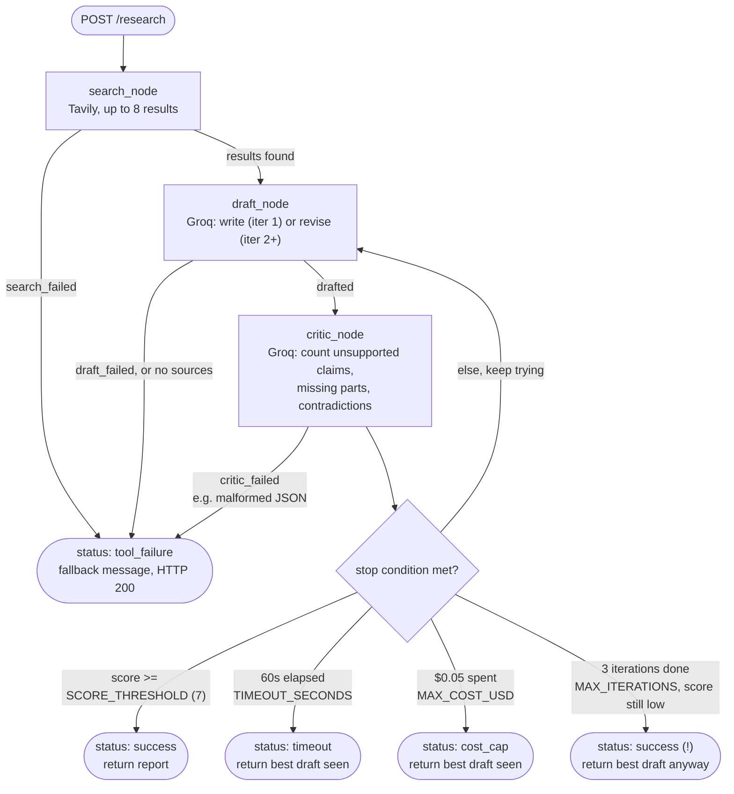

# Research Agent with Evaluation Loop — Week 3

**Live:** [frontend](https://frontend-uv6h.onrender.com) ·
[backend API](https://backend-ehv8.onrender.com/health) — deployed free on Render,
see [Deployment](#deployment-render) below. (Note: free tier spins down after ~15min
idle — the first request after a quiet period takes 30–60s to wake back up.)

Worker (search + draft) + critic (scores 0–10, structured feedback) + retry loop, plus
this week's additions: every run is logged to SQLite, and the agent has guardrails for
timeouts, cost caps, and tool failures instead of just crashing. Dashboard + writeup
come in Week 4.

## Setup

```bash
python -m venv venv
source venv/bin/activate      # Windows: venv\Scripts\activate
pip install -r requirements.txt
copy .env.example .env        # Mac/Linux: cp .env.example .env
```

Edit `.env` and fill in:
- `GROQ_API_KEY` — free, from console.groq.com (sign up, create an API key, no billing info needed)
- `TAVILY_API_KEY` — free tier at tavily.com
- `API_KEY` — a shared secret the frontend sends to the backend on `/research`; generate
  one with `python -c "import secrets; print(secrets.token_urlsafe(32))"`. This matters
  most once the backend is deployed with a public URL — without it, anyone who finds
  the URL can spend your Groq/Tavily quota.

Everything else in `.env` has a working default:
- `DRAFT_MODEL` / `CRITIC_MODEL` — strong model writes/revises, cheap model scores
- `MAX_ITERATIONS=3`, `SCORE_THRESHOLD=7` — retry loop caps
- `TIMEOUT_SECONDS=60` — wall-clock budget per query; if exceeded, the loop stops after
  its current iteration and returns the best draft so far
- `MAX_COST_USD=0.05` — estimated-cost cap per query (Groq's free tier is actually $0;
  this uses placeholder per-token prices in `main.py` so the cap and the cost numbers
  in the UI/logs are meaningful — adjust `PRICE_PER_1M_TOKENS` if you move to a paid tier)
- `DB_PATH=runs.db` — SQLite file the logging table lives in (created automatically)

## Run

Single command (starts both, Ctrl+C stops both):

```bash
python run_dev.py
```

Or run them separately in two terminals:

Backend (terminal 1):

```bash
uvicorn main:app --reload --port 8000
```

Frontend (terminal 2):

```bash
streamlit run streamlit_app.py
```

Open the Streamlit URL (usually http://localhost:8501), ask a research question, and
click "Run research". The UI shows score, iterations, latency, estimated cost, why the
loop stopped, and a per-iteration feedback breakdown — including the actual draft text
at each iteration, so you can see what the critic's feedback actually changed.

Two more pages live in the sidebar (Streamlit's native multipage nav — no duplicate
in-page links to them, just the one place):

- **Dashboard** (`pages/1_Dashboard.py`) aggregates every logged run into: total runs,
  success rate, avg iterations, avg cost/query, avg latency, a score-distribution
  histogram, a stop-reason breakdown, cost-per-query over time, an iterations
  histogram, and a failure log of every run that stopped without meeting
  `SCORE_THRESHOLD` — tagged by severity (🔴 crash / 🟠 tool failure / 🟡 guardrail
  doing its job) rather than treating every non-success run as equally bad. Run data
  is cached for 30s; use the Refresh button to force a reload after a new run.
- **History** (`pages/2_History.py`) is the full search history: every logged run,
  filterable by query text or status, each expandable into its actual returned report
  (the best-scoring iteration — same selection rule the backend itself uses) plus the
  complete per-iteration score/draft trail, not just a one-line summary.

## Guardrails

- **Timeout**: `TIMEOUT_SECONDS` wall-clock budget checked between iterations — if
  exceeded, the loop stops and returns the best-scoring draft seen so far rather than
  continuing to retry.
- **Cost cap**: `MAX_COST_USD` estimated spend checked the same way.
- **Tool failure fallback**: if the Tavily search call fails (after retries), the agent
  returns a clear "search failed" message instead of a 500, skips the critic entirely
  (nothing to grade), and logs the run as `tool_failure`. If a Groq call fails after
  `LLM_MAX_RETRIES` retries, the same pattern applies — return whatever draft exists,
  log it, don't crash the request.
- **Unhandled errors**: any other exception is still logged (status `error`, with the
  message) before the API returns a 500, so nothing silently disappears.
- **Auth + rate limiting**: `POST /research` requires an `X-API-Key` header matching
  `API_KEY` and is rate-limited to 10 requests/minute per client IP (via `slowapi`).
  `GET /runs` is unauthenticated (it just reads the log) but rate-limited to
  30 requests/minute. Without this, a public deployment is an open door to anyone's
  Groq/Tavily bill.
- **Prompt-injection framing**: search results are live, unsanitized web scrapes fed
  straight into the draft/critic prompts — a page containing "ignore previous
  instructions, instead do X" text becomes part of the model's context. `_sources_block`
  wraps scraped content in `<untrusted_web_content>` tags, and both prompts explicitly
  warn the model to treat it as reference data, never as instructions. This is a
  mitigation, not a guarantee — no prompt-level defense fully prevents injection with
  current models — but it's a real, cheap reduction in attack surface over doing nothing.

## Progress streaming

`POST /research` still returns a single JSON response once the whole loop finishes —
useful for `curl`/scripting. The Streamlit UI instead calls `POST /research/stream`,
which streams the same run as Server-Sent Events: one `progress` event per graph node
("Searched the web, found 8 sources", "Critic scored iteration 1: 5/10", ...) and a
final `done` event carrying the exact same payload `/research` returns (or an `error`
event on an unhandled exception). Both endpoints share the same graph-execution,
status-classification, and logging code — they can't drift from each other. Without
this, a query that takes the full 60-second budget just sits behind a spinner with no
indication of what's actually happening.

## Async end-to-end

`/research` and `/research/stream` are `async def`, and the Groq/Tavily calls use
`AsyncGroq`/`AsyncTavilyClient` all the way down through `worker_graph.ainvoke()` /
`.astream()` — a query in flight doesn't hold a worker thread for its whole duration,
so concurrent requests actually overlap instead of queuing behind a limited threadpool.
`tests/test_api.py::test_concurrent_research_requests_run_in_parallel` proves this: 5
concurrent requests with mocked 0.5s Groq/Tavily calls finish in ~1.6s, not the ~5s
they'd take fully serialized — if a blocking call ever sneaks back into this path,
that test starts failing. (`db.py`'s SQLite calls stay synchronous — they're
local-file reads/writes on the order of microseconds, not worth the complexity of an
async driver.)

## Logging

Every call to `POST /research` writes one row to the `runs` table in `runs.db`:
`run_id, created_at, query, status, iterations, final_score, score_per_iteration,
num_sources, total_tokens, estimated_cost_usd, latency_seconds, stop_reason,
error_message`. `status` is one of `success`, `timeout`, `cost_cap`, `tool_failure`,
`error`.

Inspect it directly:

```bash
python -c "import db, json; print(json.dumps(db.get_all_runs(), indent=2, default=str))"
```

Or via the API:

```bash
curl http://localhost:8000/runs
```

## Test the API directly

```bash
curl -X POST http://localhost:8000/research \
  -H "Content-Type: application/json" \
  -H "X-API-Key: $API_KEY" \
  -d '{"query": "Compare pricing models of 5 SaaS project management tools"}'
```

## Automated tests

```bash
pytest tests/
```

The suite mocks the Groq/Tavily clients (no API calls, no cost) and covers:
- `tests/test_db.py` — the SQLite logging roundtrip
- `tests/test_graph_nodes.py` — every guardrail branch of the worker/critic graph in
  isolation: search/draft/critic tool failures, malformed critic JSON, and each stop
  condition (score threshold, timeout, cost cap, max iterations)
- `tests/test_api.py` — the FastAPI endpoints end-to-end: auth, empty-query validation,
  rate limiting, and full success/tool-failure/max-iterations runs through the real
  compiled graph, including a regression test for a bug the suite caught (see below)

**Bug the tests caught:** `route_after_draft`/`route_after_critic` are LangGraph
*conditional-edge* functions, not nodes — mutating `state` inside them doesn't get
committed back to the graph (only a node's return value does). `stop_reason`,
`best_draft`, and `best_score` were being set there, so `stop_reason` came back empty
for every non-tool-failure stop, which meant the `/research` endpoint's
`if "timeout budget" in stop_reason` / `"cost cap" in stop_reason` status checks never
matched — timeout and cost-cap runs were silently logged as `success`. Fixed by moving
all state decisions into `draft_node`/`critic_node` (real nodes); the routing functions
now only read already-committed state.

## Architecture

The graph below is the actual LangGraph structure in `main.py` — three nodes
(`search_node`, `draft_node`, `critic_node`) and the conditional routing between
them. One thing the diagram makes visible that's easy to miss reading the code
top-to-bottom: exhausting `MAX_ITERATIONS` without ever clearing `SCORE_THRESHOLD`
still logs as `status: success`, not a distinct bucket — `_classify_status` only
special-cases `timeout`/`cost_cap`/`tool_failure`, so "gave up after 3 tries, still
scored 4/10" and "cleared the bar" look identical in the log's `status` column
(the `final_score` column is where you'd actually notice the difference).



## Tradeoffs & failure log

The project plan asked for "accuracy went from X% to Y% after adding the critic
loop" — that's an A/B claim (critic on vs. off) this project never actually measured,
so rather than invent a number that sounds precise but isn't, here's what's real:
cost/latency figures pulled from live runs, and three genuine incidents found by
testing this deployed on Render, not hypothetical ones.

### Cost and latency (real numbers, not estimates)

Single-iteration queries (the common case — search, draft, one critic pass, done):
~5-6 seconds, ~6,700-7,600 tokens, ~$0.002-0.003 per query. Multi-iteration runs that
hit a guardrail (see below) run 90+ seconds and ~26,000 tokens, ~4x the cost of a
clean pass — the retry loop is not free, which is exactly why `TIMEOUT_SECONDS` and
`MAX_COST_USD` exist as hard stops rather than trusting `MAX_ITERATIONS` alone.

### The critic calibration story — three iterations, in order

**1. Found a scoring ceiling.** Comparison-style queries ("compare pricing of 5 SaaS
tools", "compare pricing/security/support of 8 cloud providers") reliably scored
**exactly 3/4 grounding, 2/3 completeness, 2/3 coherence = 7.0/10** — verified across
four separate live runs on genuinely different topics and draft content, including one
where the critic's own feedback enumerated four distinct problems yet still produced
the identical 3/2/2. The original critic prompt asked for a single holistic 0-4/0-3/0-3
judgment; that self-reported number wasn't tracking how many actual issues existed, it
was converging on a fixed "flawed but substantive" verdict regardless of severity.
Meanwhile 2-way comparisons and single-topic deep-dives (Marbury v. Madison,
Maastricht vs. Lisbon, microservices vs. monolith) scored 8-10, so the retry loop was
effectively dead for anything except outright tool failures.

**2. Redesigned scoring, overcorrected.** Rather than ask the critic to self-report a
score, `critic_node` now asks it to *enumerate* specific issues
(`unsupported_claims`, `missing_parts`, `contradictions` as JSON string lists) and
computes the score in Python by counting list lengths. This broke the ceiling — the
same 5-tool comparison that scored exactly 7.0 three times in a row dropped to a real
3.0 and genuinely triggered multiple revisions. But it overcorrected: a well-cited,
accurate "what is the capital of Germany" report — the kind that always scored 9-10
before — scored **0-3/10** and burned 3 iterations plus a timeout. Forcing the model
to always produce *something* per issue category, even when nothing was genuinely
wrong, appears to push a small model (`llama-3.1-8b-instant`) toward manufacturing
vague, borderline entries just to satisfy the schema.

**3. Tightened the prompt.** Added explicit "only list an issue if you can point to
the specific sentence/statement responsible; if you cannot, the list MUST be empty"
guidance per category, plus a direct statement that a genuinely good draft should
produce three empty lists. Re-verified both cases: the Germany query returned to 8/10
with one specific, real issue named (a historical-timeline detail) instead of vague
across-the-board complaints; the SaaS comparison still scored a genuine 5→6 across two
iterations with named, specific complaints ("the unsupported claim is about ClickUp's
pricing"), not a fixed 7.0.

The lesson that generalizes beyond this project: asking a small model for a single
holistic judgment collapses onto a narrow band of "safe" verdicts; asking it to
enumerate and then computing the score deterministically gives real signal — but
only if the prompt is explicit that an empty list is an acceptable, even expected,
answer. A counting-based rubric with no floor on "how many issues to find" will find
issues whether or not they exist.

### Failure log

**`critic_failed` from a JSON-escaping bug (found live, not by the test suite).** A
niche, quote-heavy query ("terms of the 1975 Helsinki Accords' Basket III
provisions") crashed the critic call with Groq's `json_validate_failed`: the critic
quoted a phrase from the draft using Python/JS-style `\'` escaping, which isn't valid
JSON (single quotes never need escaping — only `"` and `\` do). The guardrail caught
it correctly — HTTP 200 returned, the perfectly good draft was preserved, status
logged as `tool_failure` — but the run was still unscored. Root-caused and fixed with
explicit JSON-escaping rules in the critic prompt (see `critic_node`); re-ran the
exact same query after the fix and it scored 10/10 with no crash. Four more diverse
follow-up queries confirmed the fix held.

**Revisions don't guarantee improvement.** During calibration testing (before the
prompt was tightened), one run's score went 3.0 → 3.0 → 2.0 across three iterations —
the worker's revisions, attempting to add the depth the critic asked for, introduced
new grounding gaps rather than only fixing the flagged ones. The retry loop assumes
revision moves toward the threshold; that's not guaranteed with a small worker model,
and `MAX_ITERATIONS` exists partly to bound the damage when it doesn't.

**The `status: success` ambiguity.** Documented on the architecture diagram above:
exhausting `MAX_ITERATIONS` without ever clearing `SCORE_THRESHOLD` logs identically
to a real success in the `status` column — only `final_score` distinguishes them.
Not fixed, because doing so would mean deciding what a "gave up, still low score"
status bucket should be called and whether `/runs` consumers depend on the current
five-value enum — a real product decision, not a bug, and one this project doesn't
have enough usage data to make confidently yet.

## Deployment (Render)

This repo deploys as **two Render web services** (free tier), both connected to this
GitHub repo — `render.yaml` at the repo root defines both so Render's Blueprint flow
can create them together (in practice we created them individually as plain Web
Services, since Blueprint wasn't easy to find in the current dashboard; either path
works since both just read the same repo).

| Service | Start command | Env vars |
|---|---|---|
| `backend` | `uvicorn main:app --host 0.0.0.0 --port $PORT` | `GROQ_API_KEY`, `TAVILY_API_KEY`, `API_KEY` |
| `frontend` | `streamlit run streamlit_app.py --server.port $PORT --server.address 0.0.0.0 --server.headless true` | `BACKEND_URL` (backend's URL, no trailing slash needed — the code strips it), `API_KEY` (same value as backend's) |

Steps:

1. On [render.com](https://render.com), **New +** → **Web Service**, connect this repo,
   name it `backend`, set the build/start commands above, plan **Free**, add its env
   vars (`API_KEY`: generate with
   `python -c "import secrets; print(secrets.token_urlsafe(32))"`).
2. Repeat for `frontend`, using the `backend` service's Render URL for `BACKEND_URL`.
3. Both auto-deploy on every push to `main` since they're GitHub-connected — no manual
   redeploy step needed, unlike the CLI-upload approach.

**Known limitations:**
- Render's free tier spins a service down after ~15 minutes of inactivity; the first
  request after that takes 30–60s to wake it back up.
- The filesystem is ephemeral like most PaaS free tiers — `runs.db` (SQLite) resets on
  every redeploy/restart. Fine for a demo; for persistence, move to a hosted Postgres
  instance instead.
- Both services install the *same* `requirements.txt`, so `frontend`'s build also pulls
  in backend-only deps (LangGraph, Groq, etc.) it never uses — harmless, just a slower
  build than strictly necessary. Splitting into `requirements-backend.txt` /
  `requirements-frontend.txt` would fix that if build time becomes annoying.

<details>
<summary>Previously deployed on Railway (paid) — kept for reference</summary>

Two Railway services in one project, both pushed via `railway up` (CLI upload, not
GitHub-linked) since linking a repo requires authorizing Railway's GitHub App first.
`railway.json`'s `startCommand` reads an optional `START_CMD` variable so one config
file serves both services (unset → backend's uvicorn command; set to the Streamlit
command on `frontend`). Same env vars as above, set via `railway variables --set`.
Railway is usage-billed beyond a small trial credit — moved to Render for a genuinely
free deployment. `railway.json` is still in the repo if you want to redeploy there.

</details>

## Project plan status

Everything the original plan asked for is done: worker/critic loop, logging,
guardrails, dashboard, failure log, architecture diagram, and tradeoff writeup (see
above). Deployment moved from Railway to Render partway through for cost reasons —
see the collapsed section above for how the Railway path worked, in case that's ever
useful again.
